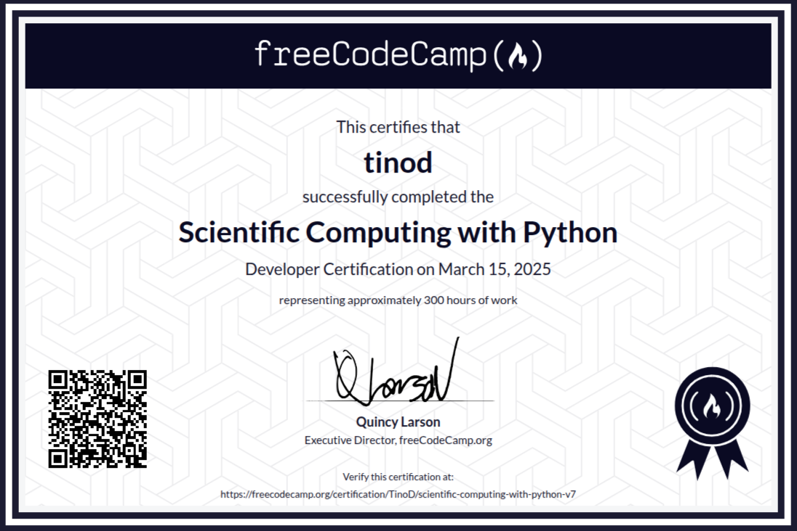

# Scientific Computing with Python Certificate

[Scientific Computing with Python Certificate](https://www.freecodecamp.org/certification/TinoD/scientific-computing-with-python-v7)
March 15, 2025

## About the Course

The Scientific Computing with Python curriculum will equip you with the skills to analyze and manipulate data using Python, a powerful and versatile programming language. You'll learn key concepts like data structures, algorithms, Object Oriented Programming, and how to perform complex calculations using a variety of tools.

This comprehensive course will guide you through the fundamentals of scientific computing, including data structures and algorithms.
